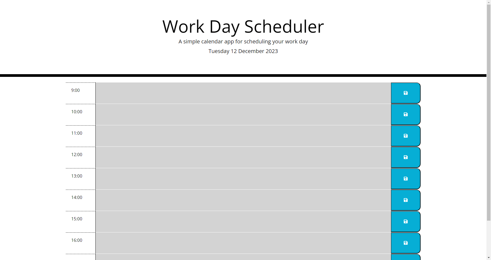

# The Daily Planner App

Welcome to my Daily Planner App.

Following on from last week's lesson on third party APIs, I have created a daily planner application using JQuery, Bootstrap and Day.js.

## About The Project

More specifically, the task for this challenge was to build a planner app with timeslots that allow you to add event text and save for later retrieval. Upon opening the application, the current day's date and time would be updated dynamically, and the timeslots would change colour to indicate whether the time slot had passed, was the current hour or yet to come.

#### [You can visit this page by clicking here.](https://whit-williams.github.io/Daily-Planner-App/)

### Technologies
This project is created with:

- Visual Studio Code 1.83.1
- Git Bash 5.2.15
- Bootstrap
- Day.js
- jQuery

### Key Features
- Displays the current day at the top of the calender when a user opens the planner.
- Presents timeblocks for standard business hours when the user scrolls down.
- Color-coded timeblocks based on past, present, and future timing.
- Allows a user to enter an event when they click a timeblock.
- Saves the event in local storage when the save button is clicked in that timeblock.
- Retrieves events when page refreshes.

### Credits 
- My very helpful tutoring session
- Many, many google searches

### License 
None
